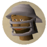

Hey, I'm Daniel, 6th year student of informatics engineering (think of it as an amalgam of computer science, software engineering, data science, IT and more). I'll be using this site mainly to write about projects I'm working on and various other things related to the field. More likely than not, most of the content will be about machine learning, considering that's where most of my development energy goes nowadays.

I'd be grateful if you took everything written here with a grain of salt, as I'm still somewhat new to ML and the way I try to hide my amateur-ness is by masking it with humor mostly derived from hyperboles.

Place your bets on whether or not I'm finishing anything that I'll be posting about. And feel free to contact me through my linked socials at the bottom of the sidebar. Enjoy my various errands and rants. Also I use "I" and "we" interchangeably while writting, don't think about that too much.

_My OSRS character with a Void ranger helm_
